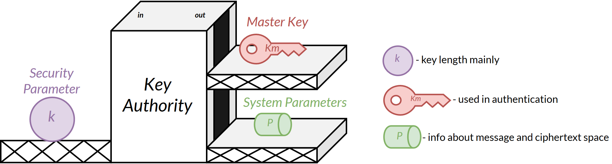
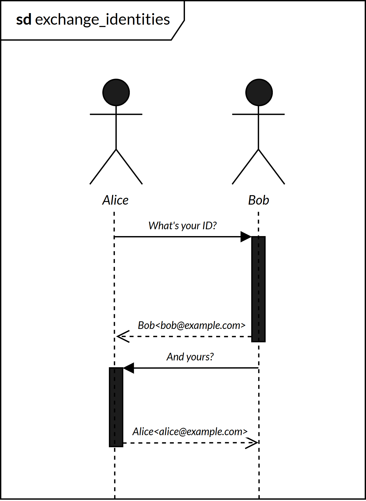
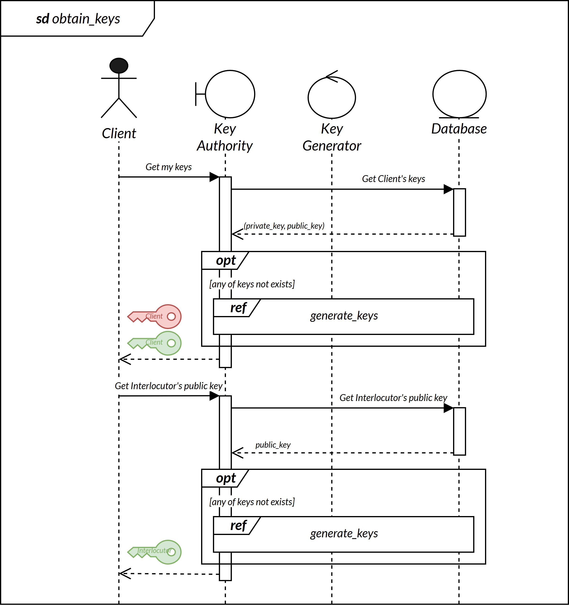
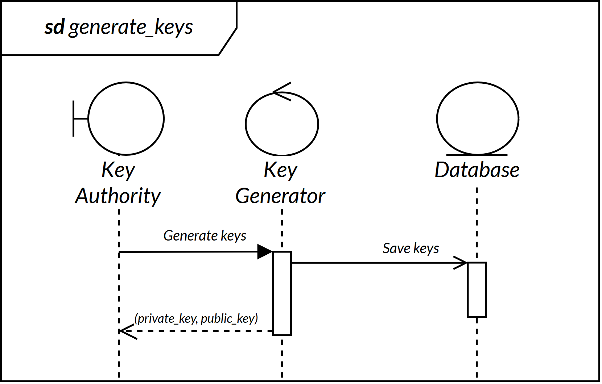
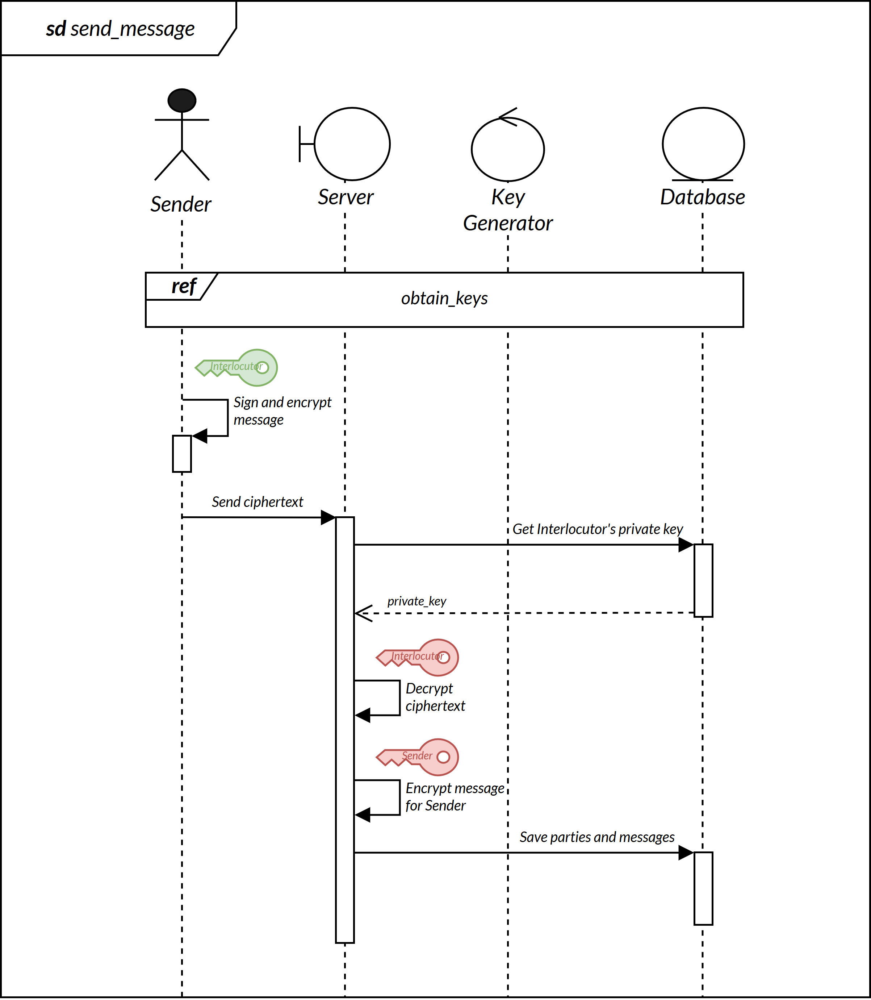
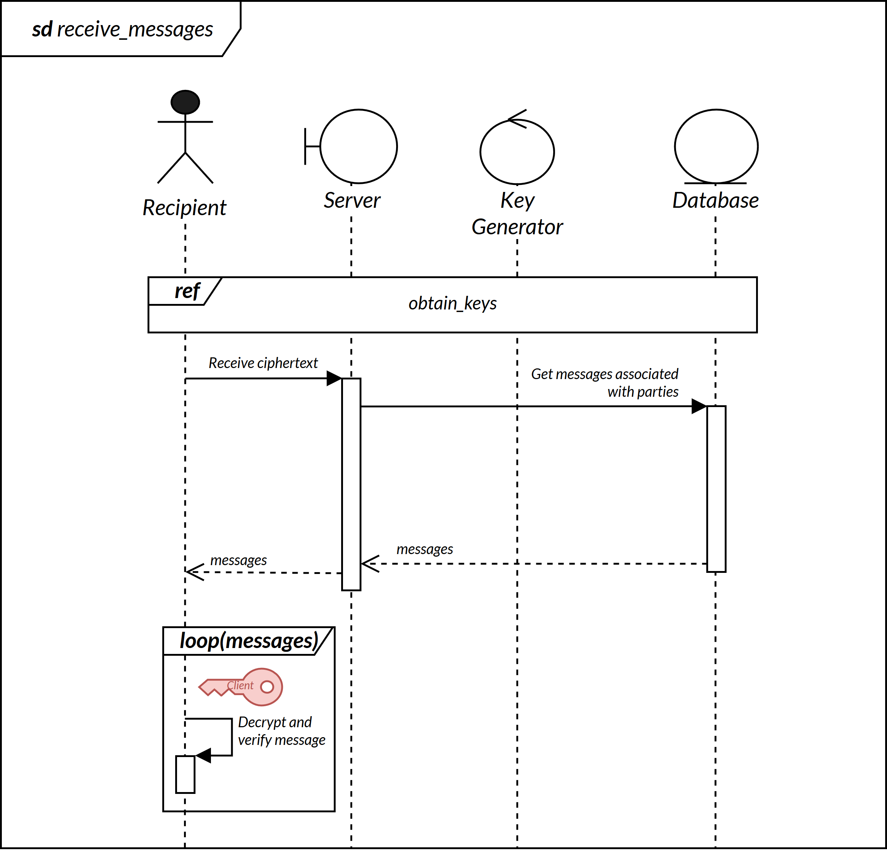

# Abstract

> Diagrams of operations. Simplified.

## Procedure

Originally, the process [should](https://crypto.stanford.edu/~dabo/pubs/papers/bfibe.pdf) implement 4 steps:

1. **Setup** - create IBE environment system parameters (master public key, parameters of encryption, message and ciphertext space). Made by *Private Key Generator*.
2. **Extract** - get private key. Made by *Client*.
3. **Encrypt** - encrypt message using system parameters and Recipient's public key. Made by *Sender*.
4. **Decrypt** - decrypt ciphertext using Recipient's private key. Made by *Recipient*.

The following proof of concept is a little bit different, but the idea was preserved.

**Note**: *Extract* process should be made in an isolated, secure way, preliminarily off-line in the cooperation with system administrator. However this project simplifies the process for getting the private key from *PKG* explicitly.

## Implementation

### Setup

*Fig.1. Setup. In this project the Server has a role of Key Authority.*

*Fig. 2. Identity exchange between parties.*

*Fig.3. Key obtainment.*

*Fig.4. Key generation.*

### Chat

*Fig.5. Message sending*.

*Fig.6. Message receiving*.
